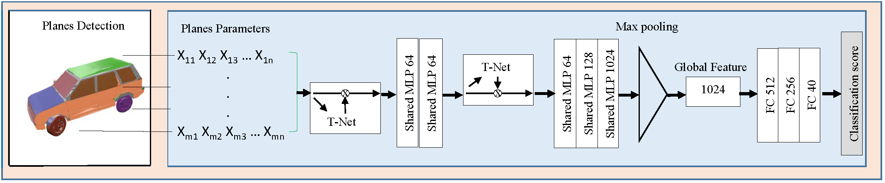

# PL-Net3D: Robust 3D Object Class Recognition Using Geometric Models


### Citation
```
@ARTICLE{8895750,
author={A. {Mukhaimar} and R. {Tennakoon} and C. Y. {Lai} and R. {Hoseinnezhad} and A. {Bab-Hadiashar}},
journal={IEEE Access},
title={PL-Net3d: Robust 3D Object Class Recognition Using Geometric Models},
year={2019},
volume={7},
number={},
pages={163757-163766},
keywords={Object recognition;point cloud classification;primitive fitting;robust classification},
doi={10.1109/ACCESS.2019.2952638},
ISSN={2169-3536},
month={},}
```





### Introduction

Three-dimensional point clouds produced by 3D scanners are often noisy and contain outliers. Such data inaccuracies can significantly affect current deep learning-based methods and reduce their ability to classify objects. Most deep neural networks-based object classification methods were targeted to achieve high classification accuracy without considering classification robustness. Thus, despite their great success, they still fail to achieve good classification accuracy with low levels of noise and outliers. This work is carried out to develop a robust network structure that can solidly identify objects. The proposed method uses patches of planar segments, which can robustly capture object appearance. The planar segments information are then fed into a deep neural network for classification. We base our approach on the PointNet deep learning architecture. Our method was tested against several kinds of data inaccuracies such as scattered outliers, clustered outliers, noise and missing points. The proposed method shows excellent performance in the presence of these inaccuracies compared to state-of-the-art techniques. By decomposing objects into planes, the suggested method is simple, fast, provides good classification accuracy and can handle different kinds of point cloud data inaccuracies.

### Requirements:
The code uses the following:
* Matlab.
* [PointNet](https://github.com/charlesq34/pointnet). The code was tested with python 3.6 and tensorflow 1.10. However the code can run on python 2.7 and older tensorflow versions. 

We used matlab for the extraction of planar primitives from a given point cloud, while we used PointNet for classification using the extracted planar data. 


### Usage

#### Dataset
Download and unzip MODELNET40 dataset:

```
mkdir data
cd data
wget --no-check-certificate https://shapenet.cs.stanford.edu/media/modelnet40_ply_hdf5_2048.zip
unzip modelnet40_ply_hdf5_2048.zip
```
And then run the file 'convert_h5_m.m' to convert the h5 files to .m files, one training and one testing file will be generated.

### Training and testing

#### Extracting planar geometris

After obtaining the .m files from the above step, run the main.m file to extract planar geometries from objects. After the codes finish, it will generate one testing and one training h5 files which will be used as an input to PointNet. <br/><br/>
The thersholds can be modified at line 37 from the 'processdata.m' file. <br/>
The max number of planes can be modified at line 63 from the 'processdata.m' file. <br/>
Augmentation can be achieved by modifying line 47 to 50 in main.m file. <br/>

#### Using the extracted planar geometris in PoinNet

After obtaining the training and testing h5 files from the above step, add thier path to the text files in pointnet/data/modelnet40_ply_hdf5_2048. Then run the training file in pointnet folder:
```
python train.py
```
#### Robustness tests

To train the network to achieve better robustness against data augmentation, we used three sets of the training data with the following properties:
```
distance threshold 0.08,  normal threshold 0.3
distance threshold 0.08,  normal threshold 0.1
distance threshold 0.08,  normal threshold 0.3, at noise level of 0.01
```
While the threshold values for the testing data was not changed:
```
distance threshold 0.08,  normal threshold 0.3
```


### Acknowledgement
We used [PointNet](https://github.com/charlesq34/pointnet) with the following modifications:

* The number of points in PointNet is set to the number of planes (20 default).
* Each planar geometiry is represneted by a vector of size 11 (default), therefore in 'pointnet_cls.py': The placeholder_inputs class, the size should be set to 11 instead of 3. In the get_model class, The size of the fist conv2d is set to 11 instead of 3.
* The rotate data classes in provider.py is modified.   
* The 'jitter_point' command in the training file is not required ( jittering is performed in matlab).

### License
This repository is released under MIT License.
